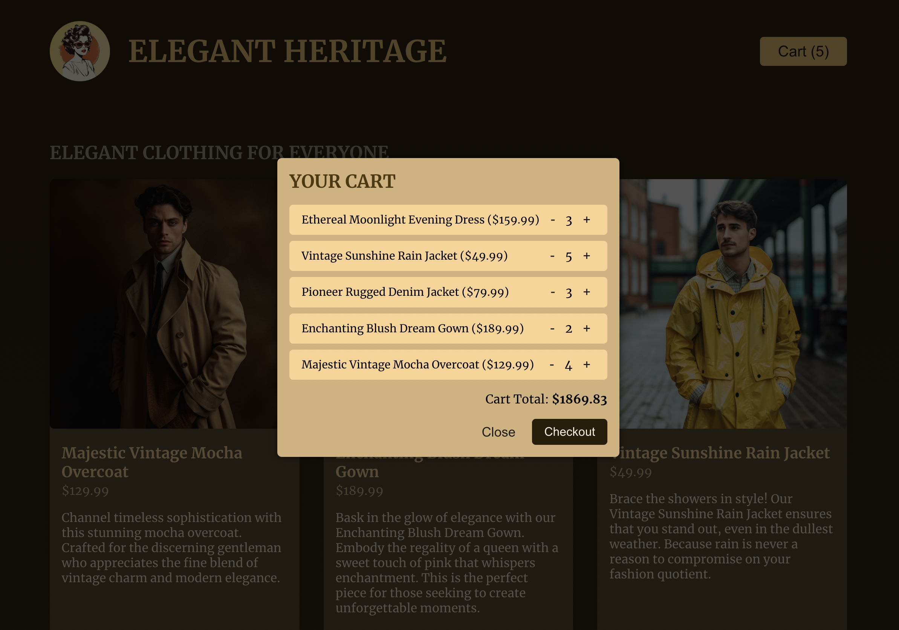

# Elegant Heritage - React E-commerce App

Elegant Heritage is a sleek and responsive e-commerce application designed to showcase a curated selection of vintage and modern clothing styles. The app is built using **React.js** and leverages **React Context API** and the **useContext Hook** to manage state efficiently, minimizing complexity and avoiding prop drilling.

## Features

### Product Catalog

- Displays a collection of clothing items with images, descriptions, and prices.
- Each product card includes a button to add items to the shopping cart.
- The layout is designed for a visually appealing and user-friendly experience.

### Shopping Cart

- A responsive cart that updates dynamically as items are added or removed.
- Allows users to adjust quantities for each product in the cart.
- Automatically calculates and displays the total cart value in real time.

### State Management

- Implemented **React Context API** to manage global state (cart data) and avoid the hassle of prop drilling across components.
- The **useContext Hook** simplifies the process of accessing and updating shared state throughout the application.

### Modern Design

- Styled with a consistent theme and responsive design to ensure an enjoyable user experience across devices.

### Key Features Breakdown

1. **Add to Cart**: Users can add individual items to their cart with a single click.
2. **Cart Overlay**: The cart is displayed as an overlay, providing a seamless shopping experience.
3. **Quantity Management**: Intuitive "+" and "−" buttons allow users to modify item quantities directly within the cart.
4. **Total Calculation**: The application dynamically calculates the total price based on selected items and their quantities.

## Technical Concepts

## Screenshots

### Homepage


### Shopping Cart



---

### State Management with React Context

- The application uses `React.createContext` to set up a global state provider, which wraps around the application.
- `useContext` is employed in components to access and update the shared state directly, reducing the need for excessive prop passing.

### Component Design

- **Reusable Components**: Modular components like `ProductCard` and `Cart` were created to enhance reusability and maintainability.
- **Minimal App.js Complexity**: By abstracting state management and UI logic into context providers and child components, `App.js` remains clean and focused.

### Scalability

- The architecture of this application is designed to support future enhancements, such as user authentication, payment gateway integration, or expanded product catalogs.

## How to Run the Project Locally

1. Clone the repository:
   ```bash
   git clone https://github.com/seetaramoruganti/Prop_drilling_solution.git
   cd Prop_drilling_solution
   ```
